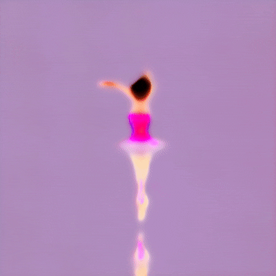
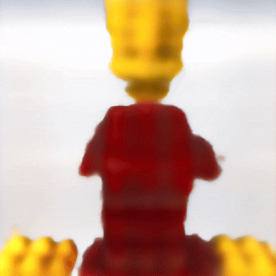

# **Latent-Gaussian Splatting with NSFD for Enhanced Text-to-3D Generation**

Text-guided image generation has progressed rapidly in recent years, inspiring major breakthroughs in text-guided shape generation. Building upon recent advances in 3D generation, we propose implementing Noise-Free Score Distillation (NSFD) instead of traditional Score Distillation Sampling (SDS). Our approach maintains the benefits of latent space diffusion while providing significant improvements in generation quality, geometric fidelity, and visual detail.
NSFD eliminates unwanted noise components from the gradient calculation, leading to more stable training and higher quality results.
Our experiments demonstrate significant improvements over the baseline Latent-NeRF approach, including enhanced detail preservation, better multi-view consistency, and superior rendering quality as measured by PSNR and SSIM metrics.

# Our Results 🎨
## Generated 3D Models



## Additional Examples




# Acknowledgments

Our work builds upon the following research:

- [Latent-NeRF for Shape-Guided Generation of 3D Shapes and Textures](https://arxiv.org/abs/2211.07600) (Metzer et al., 2022)
- [Noise-Free Score Distillation](https://arxiv.org/abs/2310.17590) (Katzir et al., 2023)

```bibtex
@article{metzer2022latent,
  title={Latent-NeRF for Shape-Guided Generation of 3D Shapes and Textures},
  author={Metzer, Gal and Richardson, Elad and Patashnik, Or and Giryes, Raja and Cohen-Or, Daniel},
  journal={arXiv preprint arXiv:2211.07600},
  year={2022}
}
```

```bibtex
@article{katzir2023noisefree,
  title={Noise-Free Score Distillation},
  author={Katzir, Oren and Patashnik, Or and Cohen-Or, Daniel and Lischinski, Dani},
  journal={arXiv preprint arXiv:2310.17590},
  year={2023}
}
```
